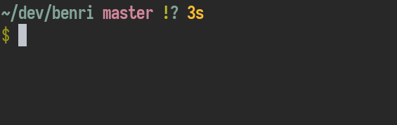

# benri


A minimal prompt written in Go



Following the [suckless philosophy](https://suckless.org/philosophy/), this project focuses on extensibility
via source code and not by config files.

## Installation

Requires: 
- Go

```bash
$ git clone https://github.com/fsmiamoto/benri
$ cd benri
# This adds benri to your GOBIN directory
$ make install
```

## Usage

You can use my [zsh prompt](https://github.com/fsmiamoto/dotfiles/blob/master/.zsh/prompt.zsh) as an example but for simple
usage you can just add this to your `.zshrc`:

```bash
# This will run Benri before your prompt
precmd() { /path/to/benri }
```
